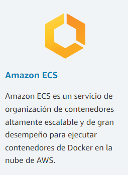
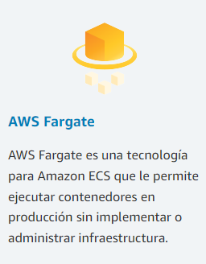
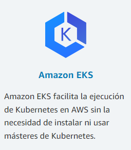
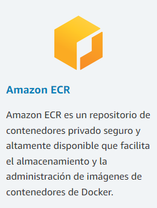
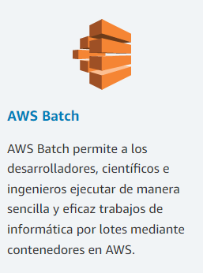
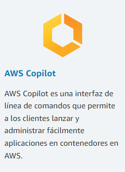

# Docker

Lorem Ipsum es simplemente el texto de relleno de las imprentas y archivos de texto. Lorem Ipsum ha sido el texto de relleno estándar de las industrias desde el año 1500, cuando un impresor (N. del T. persona que se dedica a la imprenta) desconocido usó una galería de textos y los mezcló de tal manera que logró hacer un libro de textos especimen. No sólo sobrevivió 500 años, sino que tambien ingresó como texto de relleno en documentos electrónicos, quedando esencialmente igual al original. Fue popularizado en los 60s con la creación de las hojas "Letraset", las cuales contenian pasajes de Lorem Ipsum, y más recientemente con software de autoedición, como por ejemplo Aldus PageMaker, el cual incluye versiones de Lorem Ipsum.
Lorem Ipsum es simplemente el texto de relleno de las imprentas y archivos de texto. Lorem Ipsum ha sido el texto de relleno estándar de las industrias desde el año 1500, cuando un impresor (N. del T. persona que se dedica a la imprenta) desconocido usó una galería de textos y los mezcló de tal manera que logró hacer un libro de textos especimen. No sólo sobrevivió 500 años, sino que tambien ingresó como texto de relleno en documentos electrónicos, quedando esencialmente igual al original. Fue popularizado en los 60s con la creación de las hojas "Letraset", las cuales contenian pasajes de Lorem Ipsum, y más recientemente con software de autoediciónh, como por ejemplo Aldus PageMaker, el cual incluye versiones de Lorem Ipsum.

Lorem Ipsum es simplemente el texto de relleno de las imprentas y archivos de texto. Lorem Ipsum ha sido el texto de relleno estándar de las industrias desde el año 1500, cuando un impresor (N. del T. persona que se dedica a la imprenta) desconocido usó una galería de textos y los mezcló de tal manera que logró hacer un libro de textos especimen. No sólo sobrevivió 500 años, sino que tambien ingresó como texto de relleno en documentos electrónicos, quedando esencialmente igual al original. Fue popularizado en los 60s con la creación de las hojas "Letraset", las cuales contenian pasajes de Lorem Ipsum, y más recientemente con software de autoedición, como por ejemplo Aldus PageMaker, el cual incluye versiones de Lorem Ipsum.

Lorem Ipsum es simplemente el texto de relleno de las imprentas y archivos de texto. Lorem Ipsum ha sido el texto de relleno estándar de las industrias desde el año 1500, cuando un impresor (N. del T. persona que se dedica a la imprenta) desconocido usó una galería de textos y los mezcló de tal manera que logró hacer un libro de textos especimen. No sólo sobrevivió 500 años, sino que tambien ingresó como texto de relleno en documentos electrónicos, quedando esencialmente igual al original. Fue popularizado en los 60s con la creación de las hojas "Letraset", las cuales contenian pasajes de Lorem Ipsum, y más recientemente con software de autoedición, como por ejemplo Aldus PageMaker, el cual incluye versiones de Lorem Ipsum.

<h1  id="text">prueba</h1> 

Lorem Ipsum es simplemente el texto de relleno de las imprentas y archivos de texto. Lorem Ipsum ha sido el texto de relleno estándar de las industrias desde el año 1500, cuando un impresor (N. del T. persona que se dedica a la imprenta) desconocido usó una galería de textos y los mezcló de tal manera que logró hacer un libro de textos especimen. No sólo sobrevivió 500 años, sino que tambien ingresó como texto de relleno en documentos electrónicos, quedando esencialmente igual al original. Fue popularizado en los 60s con la creación de las hojas "Letraset", las cuales contenian pasajes de Lorem Ipsum, y más recientemente con software de autoedición, como por ejemplo Aldus PageMaker, el cual incluye versiones de Lorem Ipsum.

<h1  id="contenido">como se compone</h1>
Docker es de codigo abierto facilita el proceso de creación y diseño de contenedores el envío de imágenes y creación de versiones de imagen de los contenedores se usan como máquinas virtuales pero a diferencia de las máquinas virtuales suelen utilizarse para levantar máquinas independientes. con sistemas operativos muy ligeros lo 
que permite crear implementar copiar y mover los contenedores de un entorno a otro dado que los contenedores requieren mucho menos recursos se inician rápidamente y son fáciles de implementar con mayor densidad.
lo que significa que se puede ejecutar más servicios en la misma unidad de hardware reduciendo así los costos lo que es un punto para contenedores y trabaja con imágenes que son plantillas de sólo lectura, que definen su contenedor la imagen contiene el código que se ejecutará incluido
cualquier definición para cualquier biblioteca o dependencia que el código necesite realmente un contenedor de docker es una imagen de docker instancia da o en ejecución o que permite entregar código con mayor rapidez estandarizar las operaciones de las aplicaciones y transferir el código con facilidad lo que tiene una sintaxis sencilla y simple que aporta un control absoluto a todo la tecnología docker usa el kernel de linux y las funciones de éste pueden ejecutarse de manera independiente ofrecen un modelo de implementación basado en imágenes automatiza la implementación de las aplicaciones o conjuntos combinados de procesos que
constituyen una aplicación en un entorno de contenedores algunas de las características principales son portabilidad ligereza autosuficiencia y entre sus ventajas se pueden sonar las higueras se tienen consistencia de versiones reduce el tiempo las actualizaciones y despliegue de las aplicaciones ocupa menos espacio en disco de igual forma se pueden mencionar la curva de aprendizaje que puede ser algo complicado y exigente en un principio y si quieres empezar con

### ㅤㅤ
### ㅤㅤ
<!-- Inicia la investigacion de docker con AWS-->

## **La ejecución de Docker en AWS**

La ejecución de Docker en AWS les ofrece a desarrolladores y administradores una manera muy confiable y económica de crear, enviar y ejecutar aplicaciones distribuidas en cualquier escala.

Docker colabora con AWS para ayudar a los desarrolladores a acelerar la entrega de aplicaciones modernas a la nube. Esta colaboración ayuda a los desarrolladores a utilizar Docker Compose y Docker Desktop para aprovechar el mismo flujo de trabajo local que utilizan hoy a fin de implementar sin inconvenientes aplicaciones en Amazon ECS y en AWS Fargate.
### ㅤㅤ

## **Ejecute Docker en AWS**

AWS proporciona soporte técnico para Docker de código abierto y para sus soluciones comerciales. Existen varias maneras de ejecutar contenedores en AWS, incluido Amazon Elastic Container Service (ECS), un servicio de administración de contenedores altamente escalable y de gran desempeño. Los clientes pueden implementar de manera fácil sus aplicaciones en contenedores del entorno Docker local directamente a Amazon ECS. AWS Fargate es una tecnología para Amazon ECS que permite ejecutar contenedores en producción sin implementar o administrar infraestructura. Amazon Elastic Container Service for Kubernetes (EKS) facilita la ejecución de Kubernetes en AWS. AWS Fargate es una tecnología para Amazon ECS que le permite ejecutar contenedores sin aprovisionar ni administrar servidores. Amazon Elastic Container Registry (ECR) es un repositorio de contenedores privado seguro y altamente disponible que facilita el almacenamiento y la administración de imágenes de contenedores de Docker, así como el cifrado y la compresión de imágenes en reposo de manera que se puedan extraer de manera rápida y segura. AWS Batch le permite ejecutar cargas de trabajo de procesamiento por lotes altamente escalables con contenedores de Docker.

 ㅤ ㅤ ㅤ ㅤ ㅤ ㅤ

### ㅤㅤ

 ㅤ ㅤ ㅤ ㅤ ㅤ ㅤ

### ㅤㅤ

 ㅤ ㅤ ㅤ ㅤ ㅤ ㅤ

### ㅤㅤ

## **Como usarlo en AWS**

Los pasos que aparecen a continuación le ayudarán a comenzar a usar Docker en AWS  en cuestión de minutos.
<!-- inscripcion aws -->

##### 
Inscribirse en una cuenta de AWS

[
Obtenga acceso instantáneo a la capa gratuita de AWS.
](https://aws.amazon.com/es/free/)

<!-- implementando contenedores docker en aws -->

##### 
Implemente contenedores de Docker en 10 minutos

[
Utilizar Docker Desktop: implemente contenedores de Docker en Amazon ECS en este simple tutorial con la CLI de Docker.
](https://aws.amazon.com/blogs/containers/deploy-applications-on-amazon-ecs-using-docker-compose/)

## Implemente aplicaciones en Amazon ECS mediante Docker Compose

Docker Compose es una forma elegante pero muy simple de describir su pila de aplicaciones en contenedores. Este formato ha sido utilizado y seguirá siendo utilizado por miles de desarrolladores para ejecutar aplicaciones que requieren múltiples contenedores Docker y comunicación de servicio a servicio. A menudo, estos desarrolladores también buscan una forma conveniente de ejecutar su código en AWS.

Con este espíritu en mente, AWS y Docker, comenzaron a colaborar en las especificaciones abiertas de Docker Compose para crear una ruta para que los desarrolladores utilicen el formato Docker Compose para implementar sus aplicaciones en Amazon ECS y AWS Fargate . En julio, Docker lanzó una versión beta para Docker Desktop que incorporaba estas funcionalidades y, el 15 de septiembre, Docker lanzó una experiencia actualizada en su canal estable de Docker Desktop .

Con todo este trasfondo fuera del camino, ensuciémonos las manos. El resto de este blog está estructurado en torno a dos temas principales:

- Uso de Docker Compose para ampliar las inversiones existentes
- Uso de Docker Compose para mejorar la experiencia del desarrollador de ECS

## Uso de Docker Compose para ampliar las inversiones existentes

Hace cuatro años, creé una aplicación simple (pero representativa de la vida real) que podía usar como base para aprender nuevas tecnologías. En lugar de centrarme en una tecnología en abstracto y probar el tutorial que venía con ella, quería centrarme en "mi aplicación" e intentar usar la tecnología en mi contexto definido y existente. Al final del día, esto es lo que hacen los clientes reales. Su objetivo no es ejecutar el ejemplo con éxito, sino aplicar la tecnología que están evaluando a su propia pila de aplicaciones. Simplemente quería imitar los patrones de adopción de tecnologías del cliente.

Entra Yelb . Yelb es una aplicación web tradicional con cuatro componentes: una interfaz de usuario, un servidor de aplicaciones, un servidor de caché y una base de datos.

