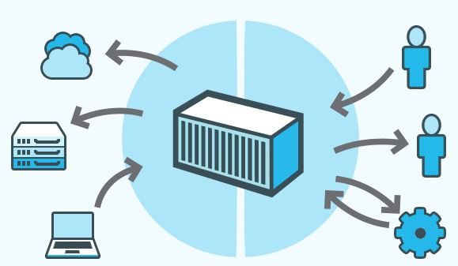

# Docker

## Que es Docker

Docker es un proyecto de código abierto para automatizar la implementación de aplicaciones como contenedores portátiles independientes que pueden ejecutarse en la nube o en las instalaciones. Docker también es una empresa que promueve y prueba esta tecnología, trabajando con proveedores de nube, Linux y Windows, incluido Microsoft.

Los contenedores de Docker pueden ejecutarse en cualquier lugar, localmente en un centro de datos del cliente, en un proveedor de servicios de terceros o en la nube de Azure. Los contenedores de imágenes de Docker pueden ejecutarse de forma nativa en Linux y Windows. Sin embargo, las imágenes de Windows solo pueden ejecutarse en hosts de Windows, y las imágenes de Linux solo pueden ejecutarse en hosts de Linux y hosts de Windows (aún con máquinas virtuales Linux Hyper-V), donde el host es el servidor o la máquina virtual.

<h1  id="contenido">como se compone</h1>
Docker es de codigo abierto facilita el proceso de creación y diseño de contenedores el envío de imágenes y creación de versiones de imagen de los contenedores se usan como máquinas virtuales pero a diferencia de las máquinas virtuales suelen utilizarse para levantar máquinas independientes. con sistemas operativos muy ligeros lo 
que permite crear implementar copiar y mover los contenedores de un entorno a otro dado que los contenedores requieren mucho menos recursos se inician rápidamente y son fáciles de implementar con mayor densidad.

###

</a>  ㅤ ㅤ ㅤ ㅤ ㅤ
</a>

lo que significa que se puede ejecutar más servicios en la misma unidad de hardware reduciendo así los costos lo que es un punto para contenedores y trabaja con imágenes que son plantillas de sólo lectura, que definen su contenedor la imagen contiene el código que se ejecutará incluido
cualquier definición para cualquier biblioteca o dependencia que el código necesite realmente un contenedor de docker es una imagen de docker instancia da o en ejecución o que permite entregar código con mayor rapidez estandarizar las operaciones de las aplicaciones y transferir el código con facilidad lo que tiene una sintaxis sencilla y simple que aporta un control absoluto a todo la tecnología docker usa el kernel de linux y las funciones de éste pueden ejecutarse de manera independiente ofrecen un modelo de implementación basado en imágenes automatiza la implementación de las aplicaciones o conjuntos combinados de procesos que
constituyen una aplicación en un entorno de contenedores algunas de las características principales son portabilidad ligereza autosuficiencia y entre sus ventajas se pueden sonar las higueras se tienen consistencia de versiones reduce el tiempo las actualizaciones y despliegue de las aplicaciones ocupa menos espacio en disco de igual forma se pueden mencionar la curva de aprendizaje que puede ser algo complicado y exigente en un principio y si quieres empezar con

### ㅤㅤ
### ㅤㅤ
<!-- Inicia la investigacion de docker con AWS-->

## **La ejecución de Docker en AWS**

La ejecución de Docker en AWS les ofrece a desarrolladores y administradores una manera muy confiable y económica de crear, enviar y ejecutar aplicaciones distribuidas en cualquier escala.

Docker colabora con AWS para ayudar a los desarrolladores a acelerar la entrega de aplicaciones modernas a la nube. Esta colaboración ayuda a los desarrolladores a utilizar Docker Compose y Docker Desktop para aprovechar el mismo flujo de trabajo local que utilizan hoy a fin de implementar sin inconvenientes aplicaciones en Amazon ECS y en AWS Fargate.
### ㅤㅤ

## **Ejecute Docker en AWS**

AWS proporciona soporte técnico para Docker de código abierto y para sus soluciones comerciales. Existen varias maneras de ejecutar contenedores en AWS, incluido Amazon Elastic Container Service (ECS), un servicio de administración de contenedores altamente escalable y de gran desempeño. Los clientes pueden implementar de manera fácil sus aplicaciones en contenedores del entorno Docker local directamente a Amazon ECS. AWS Fargate es una tecnología para Amazon ECS que permite ejecutar contenedores en producción sin implementar o administrar infraestructura. Amazon Elastic Container Service for Kubernetes (EKS) facilita la ejecución de Kubernetes en AWS. AWS Fargate es una tecnología para Amazon ECS que le permite ejecutar contenedores sin aprovisionar ni administrar servidores. Amazon Elastic Container Registry (ECR) es un repositorio de contenedores privado seguro y altamente disponible que facilita el almacenamiento y la administración de imágenes de contenedores de Docker, así como el cifrado y la compresión de imágenes en reposo de manera que se puedan extraer de manera rápida y segura. AWS Batch le permite ejecutar cargas de trabajo de procesamiento por lotes altamente escalables con contenedores de Docker.

 ㅤ ㅤ ㅤ ㅤ ㅤ ㅤ

### ㅤㅤ

 ㅤ ㅤ ㅤ ㅤ ㅤ ㅤ

### ㅤㅤ

 ㅤ ㅤ ㅤ ㅤ ㅤ ㅤ

### ㅤㅤ

## **Como usarlo en AWS**

Los pasos que aparecen a continuación le ayudarán a comenzar a usar Docker en AWS  en cuestión de minutos.
<!-- inscripcion aws -->

##### 
Inscribirse en una cuenta de AWS

[
Obtenga acceso instantáneo a la capa gratuita de AWS.
](https://aws.amazon.com/es/free/)

<!-- implementando contenedores docker en aws -->

##### 
Implemente contenedores de Docker en 10 minutos

[
Utilizar Docker Desktop: implemente contenedores de Docker en Amazon ECS en este simple tutorial con la CLI de Docker.
](https://aws.amazon.com/blogs/containers/deploy-applications-on-amazon-ecs-using-docker-compose/)

## Implemente aplicaciones en Amazon ECS mediante Docker Compose

Docker Compose es una forma elegante pero muy simple de describir su pila de aplicaciones en contenedores. Este formato ha sido utilizado y seguirá siendo utilizado por miles de desarrolladores para ejecutar aplicaciones que requieren múltiples contenedores Docker y comunicación de servicio a servicio. A menudo, estos desarrolladores también buscan una forma conveniente de ejecutar su código en AWS.

Con este espíritu en mente, AWS y Docker, comenzaron a colaborar en las especificaciones abiertas de Docker Compose para crear una ruta para que los desarrolladores utilicen el formato Docker Compose para implementar sus aplicaciones en Amazon ECS y AWS Fargate . En julio, Docker lanzó una versión beta para Docker Desktop que incorporaba estas funcionalidades y, el 15 de septiembre, Docker lanzó una experiencia actualizada en su canal estable de Docker Desktop .

Con todo este trasfondo fuera del camino, ensuciémonos las manos. El resto de este blog está estructurado en torno a dos temas principales:

- Uso de Docker Compose para ampliar las inversiones existentes
- Uso de Docker Compose para mejorar la experiencia del desarrollador de ECS

## Uso de Docker Compose para ampliar las inversiones existentes

Hace cuatro años, creé una aplicación simple (pero representativa de la vida real) que podía usar como base para aprender nuevas tecnologías. En lugar de centrarme en una tecnología en abstracto y probar el tutorial que venía con ella, quería centrarme en "mi aplicación" e intentar usar la tecnología en mi contexto definido y existente. Al final del día, esto es lo que hacen los clientes reales. Su objetivo no es ejecutar el ejemplo con éxito, sino aplicar la tecnología que están evaluando a su propia pila de aplicaciones. Simplemente quería imitar los patrones de adopción de tecnologías del cliente.

Entra Yelb . Yelb es una aplicación web tradicional con cuatro componentes: una interfaz de usuario, un servidor de aplicaciones, un servidor de caché y una base de datos.

A medida que comencé a aprender diferentes soluciones basadas en contenedores a lo largo de los años, las apliqué a Yelb. Hoy puede implementar una versión en contenedor de Yelb con Docker Compose, Kubernetes y ECS . Esto me obligó a crear toda la coreografía YAML para cada uno de los orquestadores (en el orden específico que mencioné) mientras usaba las mismas imágenes de contenedor.

Desde que comenzamos esta colaboración con Docker, continué preguntándome: “¿Qué pasa si no quiero o no puedo dedicar tiempo a volver a crear el archivo YAML original de Docker Compose en un archivo ECS YAML nativo ? ¿Funcionaría esta integración de Docker Compose/ECS para Yelb?” Mi archivo Yelb Docker Compose es uno entre los 650.000 que mencioné anteriormente.

Curiosamente, mi prueba funcionó de inmediato con el archivo Docker Compose que creé hace más de 4 años .

Déjame mostrarte cómo es la experiencia del desarrollador. Más adelante, tocaremos la mecánica de cómo funciona esto detrás de escena. Por ahora lo único que necesitas es Docker Desktop y una cuenta de AWS . Para esta prueba, estoy usando Docker Desktop (estable) versión 2.5.0.1.

Lo primero que debe hacer es clonar el repositorio de Yelb y pasar al directorio de implementación que incluye el archivo Compose YAML en el repositorio ( docker-compose.yaml):

~~~
➜ git clone https://github.com/mreferre/yelb 
Cloning into 'yelb'...
remote: Enumerating objects: 4, done.
remote: Counting objects: 100% (4/4), done.
remote: Compressing objects: 100% (4/4), done.
remote: Total 805 (delta 0), reused 0 (delta 0), pack-reused 801
Receiving objects: 100% (805/805), 3.41 MiB | 1.25 MiB/s, done.
Resolving deltas: 100% (416/416), done.

➜ cd ./yelb/deployments/platformdeployment/Docker/

➜ ls
README.md docker-compose.yaml stack-deploy.yaml
~~~

Ahora podemos docker-compose upel archivo Compose YAML en el repositorio. Esto, por defecto, creará una instancia de la aplicación Yelb en su estación de trabajo:

~~~
➜ docker-compose up -d
Creating network "docker_yelb-network" with driver "bridge"
Creating docker_yelb-db_1 ... done
Creating docker_redis-server_1 ... done
Creating docker_yelb-appserver_1 ... done
Creating docker_yelb-ui_1 ... done
~~~

Puede probar que todo funciona apuntando su navegador web a la http://localhostde su máquina. Debería ver la aplicación de votación de Yelb:

Si la prueba fue exitosa, ahora puede romper su pila local ejecutando docker-compose down. Si proviene de Docker, probablemente haya utilizado este flujo de trabajo miles de veces durante varios años. Nada nuevo aquí.

Como solemos decir, una imagen vale más que 1000 palabras. Esta es una representación visual del flujo que acabamos de ejecutar (observe que aún no se implementa nada en la nube de AWS):

Veamos ahora cómo podemos implementar la misma pila en ECS. Para hacer esto, debemos preparar nuestro entorno Docker Desktop .

Primero, crearemos un nuevo contexto de ventana acoplable para que la CLI de Docker pueda apuntar a un punto final diferente. De forma predeterminada, Docker apunta a un contexto local llamado default(que es el tiempo de ejecución de Docker en su máquina), pero agregaremos un contexto de Amazon ECS con el comando docker context create ecs.

Una nota sobre las credenciales de AWS: si ya está familiarizado con AWS, probablemente ya tenga listo su entorno AWS CLI con un perfil predeterminado o con nombre. Está bien, la CLI de Docker puede usar esas credenciales. De lo contrario, el flujo de trabajo de Docker le permitirá leer las variables de entorno con sus credenciales de AWS ( AWS_ACCESS_KEY_IDy AWS_SECRET_ACCESS_KEY) o le pedirá esas credenciales y las almacenará por usted (en $HOME/.aws/credentials).

En este ejemplo, apunto el flujo de trabajo de Docker a mi perfil de AWS existente:

~~~
➜ docker context create ecs myecscontext
? Create a Docker context using: An existing AWS profile
? Select AWS Profile default
Successfully created ecs context "myecscontext"  
~~~

Ahora, Docker tiene una llamada de contexto adicional myecscontext(o tipo ecs) que apunta a mi perfil predeterminado de AWS CLI existente. Tenga en cuenta que también estamos configurando myecscontextpara que sea nuestro nuevo contexto activo (que está marcado con un *):

~~~
➜ docker context ls                     
NAME                TYPE                DESCRIPTION                               DOCKER ENDPOINT               KUBERNETES ENDPOINT   ORCHESTRATOR
default *           moby                Current DOCKER_HOST based configuration   unix:///var/run/docker.sock                         swarm
myecscontext        ecs                                                                                                               
➜ docker context use myecscontext
myecscontext
➜ docker context ls              
NAME                TYPE                DESCRIPTION                               DOCKER ENDPOINT               KUBERNETES ENDPOINT   ORCHESTRATOR
default             moby                Current DOCKER_HOST based configuration   unix:///var/run/docker.sock                         swarm
~~~

Las credenciales en el perfil de AWS deben tener suficientes permisos para implementar la aplicación en AWS. Esto incluye permisos para crear, por ejemplo, VPC, tareas de ECS, balanceadores de carga, etc.

Ahora vamos a poner la pila de Yelb en vivo en la nube.

Tenga en cuenta cómo ahora estoy usando el binario principal de la ventana acoplable para hacer esto, en lugar del docker-composebinario que he usado anteriormente para implementar localmente. El dockerbinario ahora viene con una funcionalidad ampliada para docker compose up(más sobre esto más adelante).

~~~
➜ docker compose up 
WARN[0001] networks.driver: unsupported attribute       
[+] Running 26/26
 ⠿ docker                              CreateComplete                                                                                                        345.5s
 ⠿ YelbuiTCP80TargetGroup              CreateComplete                                                                                                          0.0s
 ⠿ LogGroup                            CreateComplete                                                                                                          2.2s
 ⠿ YelbuiTaskExecutionRole             CreateComplete                                                                                                         14.0s
 ⠿ YelbnetworkNetwork                  CreateComplete                                                                                                          5.0s
 ⠿ YelbdbTaskExecutionRole             CreateComplete                                                                                                         14.0s
 ⠿ CloudMap                            CreateComplete                                                                                                         48.3s
 ⠿ Cluster                             CreateComplete                                                                                                          6.0s
 ⠿ YelbappserverTaskExecutionRole      CreateComplete                                                                                                         14.0s
 ⠿ RedisserverTaskExecutionRole        CreateComplete                                                                                                         13.0s
 ⠿ YelbnetworkNetworkIngress           CreateComplete                                                                                                          0.0s
 ⠿ Yelbnetwork80Ingress                CreateComplete                                                                                                          1.0s
 ⠿ LoadBalancer                        CreateComplete                                                                                                        122.5s
 ⠿ RedisserverTaskDefinition           CreateComplete                                                                                                          4.0s
 ⠿ YelbappserverTaskDefinition         CreateComplete                                                                                                          3.0s
 ⠿ YelbuiTaskDefinition                CreateComplete                                                                                                          3.0s
 ⠿ YelbdbTaskDefinition                CreateComplete                                                                                                          3.0s
 ⠿ RedisserverServiceDiscoveryEntry    CreateComplete                                                                                                          1.1s
 ⠿ YelbdbServiceDiscoveryEntry         CreateComplete                                                                                                          5.5s
 ⠿ YelbuiServiceDiscoveryEntry         CreateComplete                                                                                                          4.4s
 ⠿ YelbappserverServiceDiscoveryEntry  CreateComplete                                                                                                          4.4s
 ⠿ RedisserverService                  CreateComplete                                                                                                         68.2s
 ⠿ YelbdbService                       CreateComplete                                                                                                         77.7s
 ⠿ YelbuiTCP80Listener                 CreateComplete                                                                                                          5.4s
 ⠿ YelbappserverService                CreateComplete                                                                                                        108.5s
 ⠿ YelbuiService                       CreateComplete                                                                                                         76.6s 
➜ docker compose ps 
ID                                         NAME                REPLICAS            PORTS
docker-RedisserverService-bs6RqrSUuIux     redis-server        1/1                 
docker-YelbappserverService-yG2xExxLjU6D   yelb-appserver      1/1                 
docker-YelbdbService-RDGo1mRenFMt          yelb-db             1/1                 
docker-YelbuiService-X0bPBdwZmNcC          yelb-ui             1/1 
~~~

Si observa los detalles de esta pila de redacción ( docker compose ps), verá que el yelb-uicomponente está expuesto en un puerto particular de un punto final particular. En el ejemplo anterior, cuando apunto mi navegador https://docke-LoadB-C7CWCW0SZZCC-240648981.us-east-1.elb.amazonaws.com:80veo la misma aplicación (descrita en el mismo archivo de Docker Compose) implementada en ECS y Fargate.

Esta es una representación visual del flujo que hemos utilizado:

Esto es lo que sucedió tras bambalinas:

- Tú docker compose upy Docker leen eldocker-compose.yaml
- Docker convierte el archivo de composición original sobre la marcha en una plantilla de AWS CloudFormation
- Docker implementa la plantilla de CloudFormation en AWS

## Uso de Docker Compose para mejorar la experiencia del desarrollador de ECS
Hasta ahora nos hemos centrado en cómo podría reutilizar un archivo Docker Compose de 4 años . Ahora veamos cómo esta integración puede mejorar la experiencia para implementaciones futuras .

La integración de Docker Compose con Amazon ECS puede mejorar la experiencia del desarrollador en al menos un par de dimensiones: escribir menos YAML y poder probar su aplicación localmente (mientras se conecta a los servicios en la nube).

La mejor forma de explicar esto es centrándonos en otro ejemplo. Imagine que necesita implementar una aplicación que utiliza la siguiente arquitectura:

La aplicación (que se ejecuta en la tarea de ECS) lee mensajes de una cola de SQS y procesa archivos en dos carpetas de un volumen de EFS.

Configurar esta arquitectura en AWS requiere hacer lo siguiente:

crear una VPC dedicada
crear un volumen EFS
crear un clúster de ECS
crear una política y un rol de IAM para leer mensajes de SQS y colocar registros en CloudWatch
crear una definición de tarea de ECS (con el montaje de EFS y el rol de IAM adecuado)
crear un servicio ECS
inyectando un cierto número de variables de entorno
Si tuviera que codificar los detalles de la infraestructura anterior con CloudFormation, fácilmente necesitaría escribir unos cientos de líneas de YAML.

Si usara Docker Compose para definir esta aplicación, sería tan simple como escribir estas 20 líneas:

~~~
services:
  ecsworker-in-region:
    environment: 
        - SQS_QUEUE_URL=https://sqs.us-east-1.amazonaws.com/123456789/main-queue
        - EFS_SOURCE_FOLDER=/data/sourcefolder/             
        - EFS_DESTINATION_FOLDER=/data/destinationfolder/              
        - AWS_REGION=us-east-1
    image: 123456789.dkr.ecr.us-east-1.amazonaws.com/ecsworker:amd64-slim 
    volumes:
        - efs-share:/data
    x-aws-role:
        Version: '2012-10-17'
        Statement:
        - Effect: Allow
          Action: sqs:*
          Resource: arn:aws:sqs:us-east-1:123456789:main-queue
volumes:
  efs-share:
~~~

Si tiene curiosidad acerca de la naturaleza de estas x-awsextensiones de Docker Compose, consulte la última sección de este blog. En pocas palabras, x-aws-rolepermite al desarrollador asignar una política de IAM en línea que se vinculará a la aplicación (como un rol de tarea de ECS).

Si bien nuestro contexto de Docker aún apunta a nuestro punto de enlace de AWS ( myecscontext), implementaremos esta aplicación en AWS:

~~~
➜  docker compose up 
[+] Running 19/19
 ⠿ composelocal                            CreateComplete                                                                                                                                  193.5s
 ⠿ CloudMap                                CreateComplete                                                                                                                                   48.6s
 ⠿ EfsshareFilesystem                      CreateComplete                                                                                                                                    9.5s
 ⠿ LogGroup                                CreateComplete                                                                                                                                    3.7s
 ⠿ Cluster                                 CreateComplete                                                                                                                                    9.5s
 ⠿ DefaultNetwork                          CreateComplete                                                                                                                                    8.0s
 ⠿ EcsworkerinregionTaskExecutionRole      CreateComplete                                                                                                                                   14.5s
 ⠿ DefaultNetworkIngress                   CreateComplete                                                                                                                                    0.0s
 ⠿ EfsshareNFSMountTargetOnSubnetbd150891  CreateComplete                                                                                                                                   93.9s
 ⠿ EfsshareAccessPoint                     CreateComplete                                                                                                                                   18.2s
 ⠿ EfsshareNFSMountTargetOnSubnetc4f32f8f  CreateComplete                                                                                                                                   93.9s
 ⠿ EfsshareNFSMountTargetOnSubnet7fe9c173  CreateComplete                                                                                                                                   93.9s
 ⠿ EfsshareNFSMountTargetOnSubnet6301dc5c  CreateComplete                                                                                                                                   93.9s
 ⠿ EfsshareNFSMountTargetOnSubnetd56c7a8f  CreateComplete                                                                                                                                   93.9s
 ⠿ EfsshareNFSMountTargetOnSubnetc82799ac  CreateComplete                                                                                                                                   96.5s
 ⠿ EcsworkerinregionTaskRole               CreateComplete                                                                                                                                   15.0s
 ⠿ EcsworkerinregionTaskDefinition         CreateComplete                                                                                                                                    3.0s
 ⠿ EcsworkerinregionServiceDiscoveryEntry  CreateComplete                                                                                                                                    2.3s
 ⠿ EcsworkerinregionService                CreateComplete    
~~~
La aplicación ahora se ejecuta en AWS y lo único que tuve que hacer para implementarla fue escribir 20 líneas de YAML.

Sin embargo, sobre el tema de mejorar la experiencia del desarrollador, como ingeniero, también puede preguntarse cómo iterar rápidamente en esta aplicación en su estación de trabajo sin tener que implementarla necesariamente en la nube, mientras experimenta con cambios rápidos de código. La belleza de esta integración es que asigna construcciones estándar de Docker a construcciones de AWS. Tomemos la volumedeclaración, por ejemplo. Cuando se usa contra el punto final de Docker local (el defaultcontexto de Docker), volumese crea un Docker local tradicional. Sin embargo, cuando se usa con el contexto de AWS, el objeto de volumen Docker se asigna a un objeto EFS y, por lo tanto, se crea un volumen EFS.

En teoría, podríamos simplemente cambiar el contexto de Docker defaulty apuntar al tiempo de ejecución local de Docker. Si bien el archivo Compose seguiría siendo semánticamente correcto, si lo hiciéramos, no tendríamos acceso a los servicios de AWS con los que necesitamos interactuar para probar mi aplicación (es decir, SQS en mi ejemplo anterior). Esto se debe a que mi aplicación no estaría autorizada para leer de la cola de SQS, por ejemplo.

Es por eso que hemos introducido un contexto adicional de Docker que puede habilitar con la bandera `--local-simulation. Puedes crear un contexto como este:

~~~
➜ docker context create ecs --local-simulation ecsLocal
Successfully created ecs-local context "ecsLocal"
➜ docker context use ecsLocal                          
ecsLocal
➜ docker context ls                                    
NAME                TYPE                DESCRIPTION                               DOCKER ENDPOINT               KUBERNETES ENDPOINT   ORCHESTRATOR
default             moby                Current DOCKER_HOST based configuration   unix:///var/run/docker.sock                         swarm
ecsLocal *          ecs-local           ECS local endpoints 
~~~

El contexto de Docker ecsLocalse comporta de manera similar al defaultcontexto de Docker local, pero incrustará automáticamente los extremos del contenedor local de ECS . Este es un contenedor que simula los servicios de metadatos de la instancia, incluidas las credenciales de AWS IAM que obtiene del archivo $HOME/.aws/credentials file. En la nube, la venta de las credenciales de IAM ocurre al adjuntar un rol de IAM a la tarea de ECS. Localmente, esta función es simulada por los extremos del contenedor local de ECS y permite que la aplicación funcione de manera transparente.

Lo siguiente que debe hacer es docker loginextraer la imagen de ECR. Puedes hacerlo usando este comando:

~~~
echo $(aws ecr get-login-password --region us-east-1) | docker login --password-stdin --username AWS 123456789.dkr.ecr.us-east-1.amazonaws.com/ecsworker
~~~

En este punto, puede iniciar localmente la aplicación utilizando el contexto docker compose upde Docker recién creado :ecsLocal

~~~
➜ docker compose up
Starting composelocal_ecs-local-endpoints_1 ... done
Starting composelocal_ecsworker-in-region_1 ... done
Attaching to composelocal_ecs-local-endpoints_1, composelocal_ecsworker-in-region_1
ecs-local-endpoints_1 | time="2020-11-16T15:49:02Z" level=info msg="ecs-local-container-endpoints 1.3.0 (4fa3c29) ECS Agent 1.27.0 compatible"
ecs-local-endpoints_1 | time="2020-11-16T15:49:02Z" level=info msg=Running...
ecsworker-in-region_1 | Importing the env variables
ecsworker-in-region_1 | Env variables have been imported
ecsworker-in-region_1 | Initializing the boto client
ecsworker-in-region_1 | Boto client has been initialized
ecsworker-in-region_1 | Entering the infinite queue monitoring loop
~~~

Tenga en cuenta que los registros de la aplicación están disponibles en la stdoutconsola local en lugar de Cloudwatch (que es lo que sucede cuando implementa en AWS). Observe también cómo el botocliente (AWS SDK para Python) se ha inicializado correctamente en la conexión a la cola de SQS aprovechando las credenciales locales a través del contenedor de metadatos (los puntos finales del contenedor local de ECS).

Tenga en cuenta también que encontramos un pequeño error de última hora que provocó que este ejemplo no funcionara correctamente con el contexto ecsLocal al usar Docker Desktop 2.5.0.1. El problema se describe aquí y el PR para resolverlo ya se ha fusionado . La próxima versión de Docker Desktop incluirá esta solución. Para evitar el error, simplemente elimine por completo la sección `x-aws-role` en el YAML anterior cuando se ejecuta en el contexto ecsLocal.

Esta es una representación visual de lo que hemos logrado:

## [
Utilizar la consola de AWS: implemente contenedores de Docker en Amazon ECS en este simple tutorial con la consola de AWS.
](https://aws.amazon.com/es/getting-started/hands-on/deploy-docker-containers/)

## Crear una imagen de contenedor para usar en Amazon ECS

Amazon ECS utiliza imágenes de Docker en definiciones de tareas para lanzar contenedores. Docker es una tecnología que proporciona las herramientas necesarias para crear, ejecutar, probar e implementar aplicaciones distribuidas en contenedores. Docker proporciona un tutorial sobre la implementación de contenedores en Amazon ECS. Para obtener más información, consulte Implementación de contenedores Docker en Amazon ECS.

El propósito de los pasos descritos aquí es guiarlo en la creación de su primera imagen de Docker y enviar esa imagen a Amazon ECR, que es un registro de contenedor, para usarla en sus definiciones de tareas de Amazon ECS. Este tutorial asume que posee una comprensión básica de qué es Docker y cómo funciona. Para obtener más información sobre Docker, consulte ¿Qué es Docker?y la descripción general de Docker.

**Importante**

AWS y Docker han colaborado para crear una experiencia de desarrollador simplificada que le permita implementar y administrar contenedores en Amazon ECS directamente con las herramientas de Docker. Ahora puede crear y probar sus contenedores localmente con Docker Desktop y Docker Compose y luego implementarlos en Amazon ECS en Fargate. Para comenzar con la integración de Amazon ECS y Docker, descargue Docker Desktop y, opcionalmente, regístrese para obtener una ID de Docker. Para obtener más información, consulte Docker Desktopy registro de ID de Docker.

#### requisitos previos
Antes de comenzar, asegúrese de que se cumplan los siguientes requisitos previos.

- Asegúrese de haber completado los pasos de configuración de Amazon ECR. Para obtener más información, consulte Configuración de Amazon ECR en la Guía del usuario de Amazon Elastic Container Registry .

- Su usuario tiene los permisos de IAM necesarios para acceder y utilizar el servicio Amazon ECR. Para obtener más información, consulte Políticas administradas de Amazon ECR .

- Tienes Docker instalado. Para conocer los pasos de instalación de Docker para Amazon Linux 2, consulte Instalación de Docker en Amazon Linux 2 . Para todos los demás sistemas operativos, consulte la documentación de Docker en la descripción general de Docker Desktop.

- Tiene la CLI de AWS instalada y configurada. Para obtener más información, consulte Instalación de la interfaz de línea de comandos de AWS en la Guía del usuario de la interfaz de línea de comandos de AWS .

Si no tiene o necesita un entorno de desarrollo local y prefiere usar una instancia de Amazon EC2 para usar Docker, proporcionamos los siguientes pasos para lanzar una instancia de Amazon EC2 usando Amazon Linux 2 e instalar Docker Engine y la CLI de Docker.

## Crear una imagen de Docker

Las definiciones de tareas de Amazon ECS utilizan imágenes de Docker para lanzar contenedores en las instancias de contenedores de sus clústeres. En esta sección, creará una imagen de Docker de una aplicación web simple y la probará en su sistema local o instancia de Amazon EC2, y luego enviará la imagen al registro de contenedores de Amazon ECR para que pueda usarla en una definición de tareas de Amazon ECS.

***Para crear una imagen Docker de una aplicación web simple***

1. Crea un archivo llamado Dockerfile. Un Dockerfile es un manifiesto que describe la imagen base que se usará para su imagen de Docker y lo que desea instalar y ejecutar en ella. Para obtener más información sobre Dockerfiles, vaya a la Referencia de Dockerfile.

~~~
touch Dockerfile
~~~

2. Edite el Dockerfileque acaba de crear y agregue el siguiente contenido.

~~~
FROM ubuntu:18.04

# Install dependencies
RUN apt-get update && \
 apt-get -y install apache2

# Install apache and write hello world message
RUN echo 'Hello World!' > /var/www/html/index.html

# Configure apache
RUN echo '. /etc/apache2/envvars' > /root/run_apache.sh && \
 echo 'mkdir -p /var/run/apache2' >> /root/run_apache.sh && \
 echo 'mkdir -p /var/lock/apache2' >> /root/run_apache.sh && \ 
 echo '/usr/sbin/apache2 -D FOREGROUND' >> /root/run_apache.sh && \ 
 chmod 755 /root/run_apache.sh

EXPOSE 80

CMD /root/run_apache.sh
~~~

Este Dockerfile usa la imagen de Ubuntu 18.04. Las RUNinstrucciones actualizan los cachés de paquetes, instalan algunos paquetes de software para el servidor web y luego escriben "¡Hola mundo!" contenido a la raíz del documento del servidor web. La EXPOSEinstrucción expone el puerto 80 en el contenedor y la CMDinstrucción inicia el servidor web.

3. Cree la imagen de Docker desde su Dockerfile.

**Nota**
Algunas versiones de Docker pueden requerir la ruta completa a su Dockerfile en el siguiente comando, en lugar de la ruta relativa que se muestra a continuación.

~~~
docker build -t hello-world .
~~~
4. Ejecute Docker Images para verificar que la imagen se creó correctamente.
~~~
docker images --filter reference=hello-world
~~~
Producción:
~~~
ID DE LA IMAGEN DE LA ETIQUETA DEL REPOSITOR TAMAÑO CREADO
hola-mundo último e9ffedc8c286 Hace 4 minutos 241MB
~~~

5. Ejecute la imagen recién construida. La -p 80:80opción asigna el puerto 80 expuesto en el contenedor al puerto 80 en el sistema host. Para obtener más información sobre la ejecución de Docker , vaya a la referencia de ejecución de Docker.
~~~
docker run -t -i -p 80:80 hello-world
~~~
**Nota**
La salida del servidor web Apache se muestra en la ventana del terminal. Puede ignorar el Could not reliably determine the server's fully qualified domain namemensaje " ".

6. Abra un navegador y señale el servidor que ejecuta Docker y aloja su contenedor.

- Si usa una instancia EC2, este es el valor de DNS público para el servidor, que es la misma dirección que usa para conectarse a la instancia con SSH. Asegúrese de que el grupo de seguridad de su instancia permita el tráfico entrante en el puerto 80.

- Si está ejecutando Docker localmente, apunte su navegador a http://localhost/.

- Si está utilizando docker-machine en una computadora con Windows o Mac, busque la dirección IP de la VM de VirtualBox que aloja a Docker con el comando docker-machine ip , sustituyéndola machine-namepor el nombre de la máquina docker que está utilizando.

~~~
docker-machine ip machine-name
~~~
Debería ver una página web con su "¡Hola mundo!" declaración.

7. Detenga el contenedor Docker escribiendo Ctrl + c .

## Envíe su imagen a Amazon Elastic Container Registry

Amazon ECR es un servicio de registro de AWS Docker administrado. Puede usar la CLI de Docker para insertar, extraer y administrar imágenes en sus repositorios de Amazon ECR. Para obtener detalles de productos de Amazon ECR, estudios de casos de clientes destacados y preguntas frecuentes, consulte las páginas de detalles de productos de Amazon Elastic Container Registry..

**Para etiquetar su imagen y enviarla a Amazon ECR**

1. Cree un repositorio de Amazon ECR para almacenar su hello-worldimagen. Tenga en cuenta repositoryUrien la salida.
Sustituya region, con su región de AWS, por ejemplo, us-east-1.
~~~
aws ecr create-repository --repository-name hello-repository --region region
~~~
producción:
~~~
{ 
    "repositorio": { 
        "registryId": " aws_account_id",
        "repositoryName": "hola-repositorio",
        "repositoryArn": "arn:aws:ecr: region: aws_account_id:repositorio/hola-repositorio",
        "creado en": 1505337806.0,
        "repositoryUri": " aws_account_id.dkr.ecr. region.amazonaws.com/hello-repository"
    }
}
~~~
2. Etiquete la hello-worldimagen con el repositoryUri valor del paso anterior.
~~~
docker tag hello-world aws_account_id.dkr.ecr.region.amazonaws.com/hello-repository
~~~
3. Ejecute el comando aws ecr get-login-password . Especifique el URI de registro en el que desea autenticarse. Para obtener más información, consulte Autenticación del registro en la Guía del usuario de Amazon Elastic Container Registry.
~~~
aws ecr get-login-password | docker login --username AWS --password-stdin aws_account_id.dkr.ecr.region.amazonaws.com
~~~
Producción:
~~~
Inicio de sesión exitoso
~~~
**Importante**

Si recibe un error, instale o actualice a la última versión de AWS CLI. Para obtener más información, consulte Instalación de la interfaz de línea de comandos de AWS en la Guía del usuario de la interfaz de línea de comandos de AWS.

4. Envíe la imagen a Amazon ECR con el repositoryUrivalor del paso anterior.
~~~
docker push aws_account_id.dkr.ecr.region.amazonaws.com/hello-repository
~~~

### Limpiar
Para continuar con la creación de una definición de tareas de Amazon ECS y el lanzamiento de una tarea con su imagen de contenedor, salte a los Siguientes pasos . Cuando haya terminado de experimentar con su imagen de Amazon ECR, puede eliminar el repositorio para que no se le cobre por el almacenamiento de imágenes.
~~~
aws ecr delete-repository --repository-name hello-repository --region region --force
~~~

##### 
Comience a crear con Docker

[
Conceptos básicos de Docker
](https://docs.aws.amazon.com/AmazonECS/latest/developerguide/docker-basics.html)
[
Integración de Docker o ECS
](https://docs.docker.com/engine/context/ecs-integration)

## **Que necesito**

#### requisitos previos
Antes de comenzar, asegúrese de que se cumplan los siguientes requisitos previos.

- Asegúrese de haber completado los pasos de configuración de Amazon ECR. Para obtener más información, consulte Configuración de Amazon ECR en la Guía del usuario de Amazon Elastic Container Registry .

- Su usuario tiene los permisos de IAM necesarios para acceder y utilizar el servicio Amazon ECR. Para obtener más información, consulte Políticas administradas de Amazon ECR .

- Tienes Docker instalado. Para conocer los pasos de instalación de Docker para Amazon Linux 2, consulte Instalación de Docker en Amazon Linux 2 . Para todos los demás sistemas operativos, consulte la documentación de Docker en la descripción general de Docker Desktop.

- Tiene la CLI de AWS instalada y configurada. Para obtener más información, consulte Instalación de la interfaz de línea de comandos de AWS en la Guía del usuario de la interfaz de línea de comandos de AWS .

Si no tiene o necesita un entorno de desarrollo local y prefiere usar una instancia de Amazon EC2 para usar Docker, proporcionamos los siguientes pasos para lanzar una instancia de Amazon EC2 usando Amazon Linux 2 e instalar Docker Engine y la CLI de Docker.
