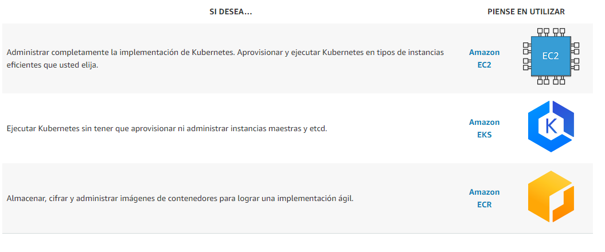
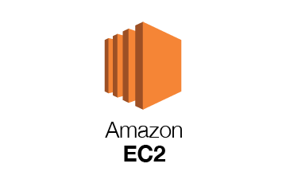
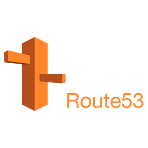
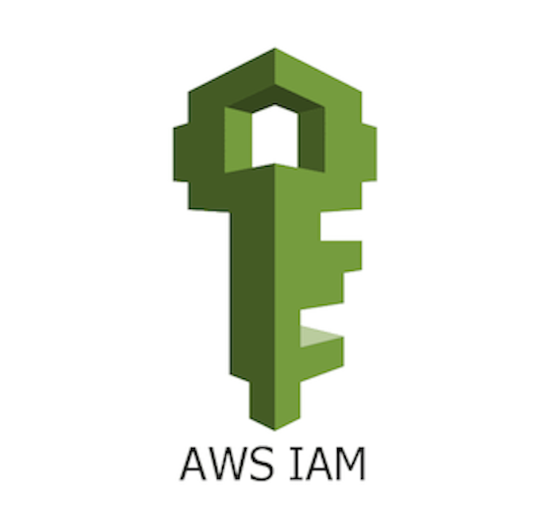

# ***
Kubernetes
***

## Que es kubernetes

Kubernetes es una plataforma portable y extensible de código abierto para administrar cargas de trabajo y servicios. Kubernetes facilita la automatización y la configuración declarativa. Tiene un ecosistema grande y en rápido crecimiento.El soporte, las herramientas y los servicios para Kubernetes están ampliamente disponibles.

Google liberó el proyecto Kubernetes en el año 2014. Kubernetes se basa en la experiencia de Google corriendo aplicaciones en producción a gran escala por década y media, junto a las mejores ideas y prácticas de la comunidad.

## **Ejecución de Kubernetes en AWS**

AWS facilita la ejecución de Kubernetes. Puede optar por ocuparse de la administración de la infraestructura de Kubernetes con Amazon EC2 o adquirir un plano de control de Kubernetes aprovisionado y administrado de manera automática con Amazon EKS. Independientemente de la estrategia que elija, obtendrá integraciones eficientes y respaldadas por la comunidad con servicios de AWS como Amazon Virtual Private Cloud (VPC), AWS Identity and Access Management (IAM) y la detección de servicios, además de la seguridad, escalabilidad y alta disponibilidad de AWS.

Es posible usar Kubernetes en AWS de dos maneras principales: ejecutarlo por su cuenta en instancias de máquinas virtuales de Amazon EC2 o usar el servicio Amazon EKS.

### Requisitos Previos 

Eso sí, antes de continuar, debemos asegurarnos de haber instalado las herramientas kubectl, kops y AWS cli. y de disponer de los permisos necesarios para que kops funcione correctamente:

 ㅤ ㅤ ㅤ ㅤ 

##

<a href="https://aws.amazon.com/free/?all-free-tier.sort-by=item.additionalFields.SortRank&all-free-tier.sort-order=asc&awsf.Free%20Tier%20Categories=categories%23storage&trk=ps_a134p000006pao0AAA&trkCampaign=acq_paid_search_brand&sc_channel=PS&sc_campaign=acquisition_IBERIA&sc_publisher=Google&sc_category=Storage&sc_country=IBERIA&sc_geo=EMEA&sc_outcome=acq&sc_detail=amazon%20s3&sc_content=S3_e&sc_matchtype=e&sc_segment=495089204081&sc_medium=ACQ-P%7CPS-GO%7CBrand%7CDesktop%7CSU%7CStorage%7CS3%7CIBERIA%7CEN%7CText&s_kwcid=AL!4422!3!495089204081!e!!g!!amazon%20s3&ef_id=Cj0KCQjwl_SHBhCQARIsAFIFRVWwQmknsGHJd8DK7jdWk9DYTDi_KAlP0IOwD1J1iQTuETDZNIQvn6MaAkTKEALw_wcB:G:s&s_kwcid=AL!4422!3!495089204081!e!!g!!amazon%20s3"></a> ㅤ ㅤ ㅤ ㅤ ㅤ ㅤ

