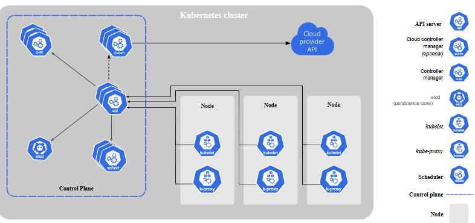
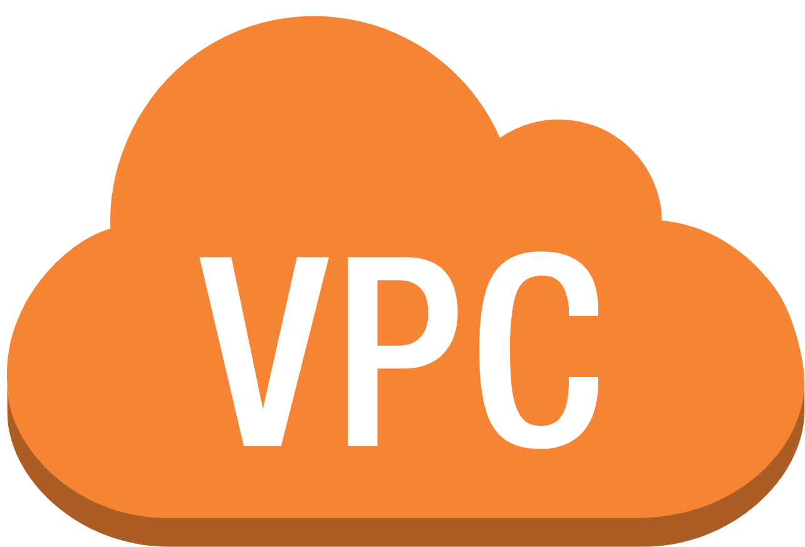

# ***
Kubernetes
***

## Que es kubernetes

Kubernetes es una plataforma portable y extensible de código abierto para administrar cargas de trabajo y servicios. Kubernetes facilita la automatización y la configuración declarativa. Tiene un ecosistema grande y en rápido crecimiento.El soporte, las herramientas y los servicios para Kubernetes están ampliamente disponibles.

Google liberó el proyecto Kubernetes en el año 2014. Kubernetes se basa en la experiencia de Google corriendo aplicaciones en producción a gran escala por década y media, junto a las mejores ideas y prácticas de la comunidad.

## **Como se compone Kubernetes**

### Componentes del plano de control

Los componentes que forman el plano de control toman decisiones globales sobre el clúster (por ejemplo, la planificación) y detectan y responden a eventos del clúster, como la creación de un nuevo pod cuando la propiedad replicas de un controlador de replicación no se cumple.

Estos componentes pueden ejecutarse en cualquier nodo del clúster. Sin embargo para simplificar, los scripts de instalación típicamente se inician en el mismo nodo de forma exclusiva, sin que se ejecuten contenedores de los usuarios en esos nodos. El plano de control se ejecuta en varios nodos para garantizar la alta disponibilidad.

### kube-apiserver

El servidor de la API es el componente del plano de control de Kubernetes que expone la API de Kubernetes. Se trata del frontend de Kubernetes, recibe las peticiones y actualiza acordemente el estado en etcd.

La principal implementación de un servidor de la API de Kubernetes es kube-apiserver. Es una implementación preparada para ejecutarse en alta disponiblidad y que puede escalar horizontalmente para balancear la carga entre varias instancias

### etcd 
Almacén de datos persistente, consistente y distribuido de clave-valor utilizado para almacenar toda a la información del clúster de Kubernetes.

Si tu clúster utiliza etcd como sistema de almacenamiento, échale un vistazo a la documentación sobre estrategias de backup.

Puedes encontrar información detallada sobre etcd en su documentación oficial.

### kube-scheduler
Componente del plano de control que ejecuta los controladores de Kubernetes.

Lógicamente cada controlador es un proceso independiente, pero para reducir la complejidad, todos se compilan en un único binario y se ejecuta en un mismo proceso.

Estos controladores incluyen:
- Controlador de nodos: es el responsable de detectar y responder cuándo un nodo deja de funcionar.
- Controlador de replicación: es el responsable de mantener el número correcto de pods para cada controlador de replicación del sistema.
- Controlador de endpoints: construye el objeto Endpoints, es decir, hace una unión entre los Services y los Pods.
- Controladores de tokens y cuentas de servicio: crean cuentas y tokens de acceso a la API por defecto para los nuevos Namespaces.

### cloud-controller-manager

cloud-controller-manager ejecuta controladores que interactúan con proveedores de la nube. El binario cloud-controller-manager es una característica alpha que se introdujo en la versión 1.6 de Kubernetes.

cloud-controller-manager sólo ejecuta ciclos de control específicos para cada proveedor de la nube. Es posible desactivar estos ciclos en kube-controller-manager pasando la opción --cloud-provider= external cuando se arranque el kube-controller-manager.

cloud-controller-manager permite que el código de Kubernetes y el del proveedor de la nube evolucionen de manera independiente. Anteriormente, el código de Kubernetes dependía de la funcionalidad específica de cada proveedor de la nube. En el futuro, el código que sea específico a una plataforma debería ser mantenido por el proveedor de la nube y enlazado a cloud-controller-manager al correr Kubernetes.

Los siguientes controladores dependen de alguna forma de un proveedor de la nube:

- Controlador de nodos: es el responsable de detectar y actuar cuándo un nodo deja de responder
- Controlador de rutas: para configurar rutas en la infraestructura de nube subyacente
- Controlador de servicios: para crear, actualizar y eliminar balanceadores de carga en la nube
- Controlador de volúmenes: para crear, conectar y montar volúmenes e interactuar con el proveedor de la nube para orquestarlos.

## Componentes De Nodo
Los componentes de nodo corren en cada nodo, manteniendo a los pods en funcionamiento y proporcionando el entorno de ejecución de Kubernetes

## kubelet
Agente que se ejecuta en cada nodo de un clúster. Se asegura de que los contenedores estén corriendo en un pod.

El agente kubelet toma un conjunto de especificaciones de Pod, llamados PodSpecs, que han sido creados por Kubernetes y garantiza que los contenedores descritos en ellos estén funcionando y en buen estado.

### kube proxy 
kube-proxy permite abstraer un servicio en Kubernetes manteniendo las reglas de red en el anfitrión y haciendo reenvío de conexiones

### Runtime De Contenedores

El runtime de los contenedores es el software responsable de ejecutar los contenedores. Kubernetes soporta varios de ellos: Docker, containerd, cri-o, rktlet y cualquier implementación de la interfaz de runtime de contenedores de Kubernetes, o Kubernetes CRI.

### Addons

Los addons son pods y servicios que implementan funcionalidades del clúster. Estos pueden ser administrados por Deployments, ReplicationControllers y otros. Los addons asignados a un espacio de nombres se crean en el espacio kube-system.

Más abajo se describen algunos addons. Para una lista más completa de los addons disponibles, por favor visite Addons.

## DNS

Si bien los otros addons no son estrictamente necesarios, todos los clústers de Kubernetes deberían tener un DNS interno del clúster ya que la mayoría de los ejemplos lo requieren.

El DNS interno del clúster es un servidor DNS, adicional a los que ya podrías tener en tu red, que sirve registros DNS a los servicios de Kubernetes.

Los contenedores que son iniciados por Kubernetes incluyen automáticamente este servidor en sus búsquedas DNS.

### Interfaz Web (Dashboard)
El Dashboard es una interfaz Web de propósito general para clústeres de Kubernetes. Le permite a los usuarios administrar y resolver problemas que puedan presentar tanto las aplicaciones como el clúster.

### Monitor de recursos de contenedores
El Monitor de recursos de contenedores almacena de forma centralizada series de tiempo con métricas sobre los contenedores, y provee una interfaz para navegar estos datos.

### Registros del clúster
El mecanismo de registros del clúster está a cargo de almacenar los registros de los contenedores de forma centralizada, proporcionando una interfaz de búsqueda y navegación.

##

## **Ejecución de Kubernetes en AWS**

AWS facilita la ejecución de Kubernetes. Puede optar por ocuparse de la administración de la infraestructura de Kubernetes con Amazon EC2 o adquirir un plano de control de Kubernetes aprovisionado y administrado de manera automática con Amazon EKS. Independientemente de la estrategia que elija, obtendrá integraciones eficientes y respaldadas por la comunidad con servicios de AWS como Amazon Virtual Private Cloud (VPC), AWS Identity and Access Management (IAM) y la detección de servicios, además de la seguridad, escalabilidad y alta disponibilidad de AWS.

Es posible usar Kubernetes en AWS de dos maneras principales: ejecutarlo por su cuenta en instancias de máquinas virtuales de Amazon EC2 o usar el servicio Amazon EKS.

### Requisitos Previos 

Eso sí, antes de continuar, debemos asegurarnos de haber instalado las herramientas kubectl, kops y AWS cli. y de disponer de los permisos necesarios para que kops funcione correctamente:

 ㅤ ㅤ ㅤ ㅤ 

##

<a href="https://aws.amazon.com/free/?all-free-tier.sort-by=item.additionalFields.SortRank&all-free-tier.sort-order=asc&awsf.Free%20Tier%20Categories=categories%23storage&trk=ps_a134p000006pao0AAA&trkCampaign=acq_paid_search_brand&sc_channel=PS&sc_campaign=acquisition_IBERIA&sc_publisher=Google&sc_category=Storage&sc_country=IBERIA&sc_geo=EMEA&sc_outcome=acq&sc_detail=amazon%20s3&sc_content=S3_e&sc_matchtype=e&sc_segment=495089204081&sc_medium=ACQ-P%7CPS-GO%7CBrand%7CDesktop%7CSU%7CStorage%7CS3%7CIBERIA%7CEN%7CText&s_kwcid=AL!4422!3!495089204081!e!!g!!amazon%20s3&ef_id=Cj0KCQjwl_SHBhCQARIsAFIFRVWwQmknsGHJd8DK7jdWk9DYTDi_KAlP0IOwD1J1iQTuETDZNIQvn6MaAkTKEALw_wcB:G:s&s_kwcid=AL!4422!3!495089204081!e!!g!!amazon%20s3"></a> ㅤ ㅤ ㅤ ㅤ 

##

